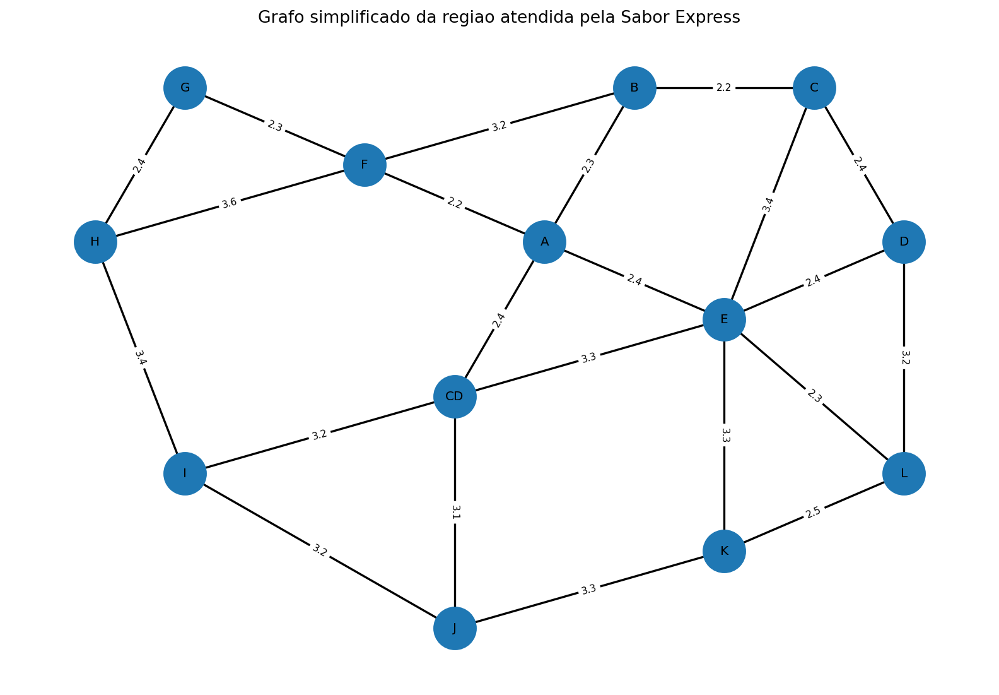
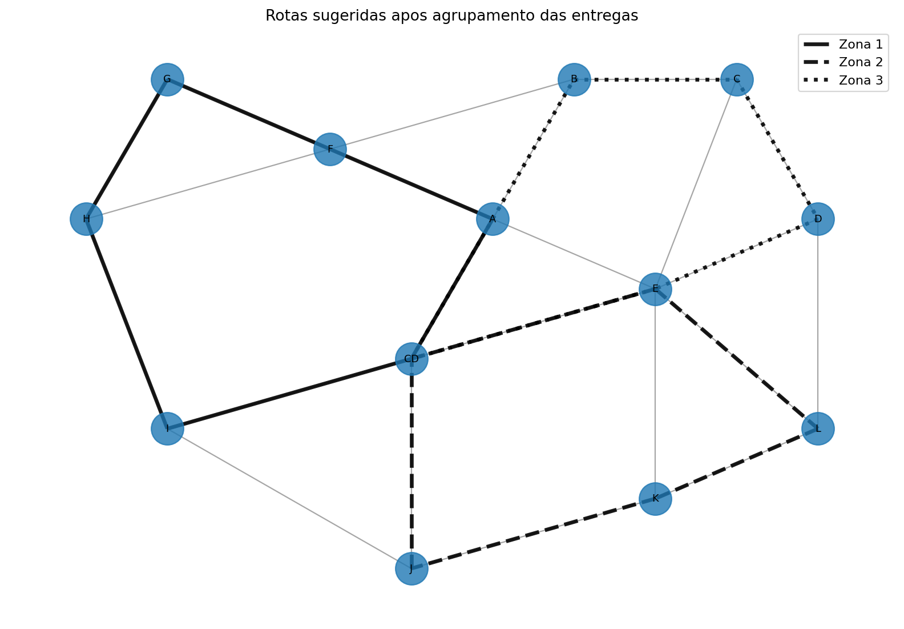

# Rota Inteligente: Otimização de Entregas com Algoritmos de IA

Projeto acadêmico da disciplina **Artificial Intelligence Fundamentals**.

**Aluno:** Mateus Santiago Batista Lima
**Instituição:** Unifecaf 
**Data:** 2026

> Os dados utilizados neste projeto são fictícios e foram criados apenas para demonstrar a solução.

## 1. Descrição do problema

A empresa fictícia **Sabor Express** realiza entregas de alimentos na região central da cidade. Em horários de maior movimento, as rotas definidas manualmente podem causar atrasos, aumento da distância percorrida e maior gasto com combustível.

O objetivo deste projeto é criar uma solução simples que ajude a organizar os pedidos e sugerir rotas melhores para os entregadores.

## 2. Objetivos

- representar a região de entregas usando um grafo;
- encontrar caminhos entre os pontos usando o algoritmo A*;
- agrupar pedidos próximos usando K-Means;
- criar uma rota para cada grupo de entregas;
- comparar de forma simples A*, BFS e DFS;
- gerar arquivos e imagens para analisar os resultados.

## 3. Abordagem adotada

A solução foi dividida em duas etapas principais.

### 3.1 Agrupamento das entregas

Cada ponto de entrega possui coordenadas fictícias `x` e `y`. O algoritmo **K-Means** usa essas coordenadas para separar os pedidos em três zonas. A ideia é evitar que um mesmo entregador fique indo de um lado para outro da cidade sem necessidade.

### 3.2 Busca de caminhos

A região foi representada como um grafo. Os pontos são bairros ou locais importantes e as ligações são ruas. Cada rua possui uma distância em quilômetros.

Para encontrar o caminho entre dois pontos, foi usado o **A***. Ele considera a distância das ruas e também uma estimativa em linha reta até o destino.

Depois do agrupamento, cada zona recebe uma rota própria. A rota começa no **Centro de Distribuição (CD)**, visita os pedidos daquele grupo e retorna ao CD.

## 4. Algoritmos utilizados

### A*

Foi escolhido como principal algoritmo de busca porque o mapa possui ruas com distâncias diferentes. Assim, não basta contar quantas ruas existem no caminho; também é importante considerar o peso de cada ligação.

### BFS

Foi usado apenas para uma comparação simples. O BFS procura um caminho com menor quantidade de passos, mas não leva em conta diretamente as diferentes distâncias das ruas.

### DFS

Também foi usado para comparação. O DFS segue um caminho em profundidade antes de voltar e testar outras opções. Dependendo da ordem dos pontos, pode encontrar um caminho bem maior.

### K-Means

Foi usado para separar as entregas em três zonas. Dessa forma, pedidos próximos ficam no mesmo grupo antes da criação das rotas.

## 5. Diagrama do grafo

O grafo usado na simulação possui um centro de distribuição e pontos de passagem ou entrega. Os pesos das ligações representam distâncias fictícias em quilômetros.



## 6. Estrutura do projeto

```text
rota-inteligente-sabor-express/
├── data/
│   ├── arestas.csv
│   ├── entregas.csv
│   └── pontos.csv
├── docs/
│   └── grafo_cidade.png
├── outputs/
│   ├── comparacao_buscas.csv
│   ├── entregas_com_zonas.csv
│   ├── resumo_resultados.txt
│   ├── resumo_rotas.csv
│   └── rotas_por_zona.png
├── src/
│   ├── agrupamento.py
│   ├── grafo.py
│   ├── main.py
│   └── rotas.py
├── .gitignore
├── requirements.txt
└── README.md
```

## 7. Como executar

É necessário ter o **Python 3.10 ou superior** instalado.

### 1. Criar um ambiente virtual (opcional)

No Windows:

```bash
python -m venv .venv
.venv\Scripts\activate
```

### 2. Instalar as bibliotecas

```bash
pip install -r requirements.txt
```

### 3. Executar o projeto

```bash
python src/main.py
```

Depois da execução, os resultados serão salvos nas pastas `outputs` e `docs`.

## 8. Resultados obtidos

Os valores abaixo são gerados a partir dos dados fictícios do projeto.

<!-- RESULTADOS -->

Nesta execução, as 9 entregas foram separadas em três zonas:

| Zona | Entregas | Distância da rota |
|---|---|---:|
| 1 | I, H, G e F | 15,9 km |
| 2 | L e K | 14,5 km |
| 3 | B, C e D | 15,0 km |

A distância total das três rotas foi de **45,4 km**. Cada rota começa e termina no Centro de Distribuição.

Na comparação de busca do **CD até o ponto K**, o A* encontrou uma rota de **6,4 km**, o BFS encontrou uma rota de **6,6 km** e o DFS, seguindo a ordem de exploração do grafo, percorreu **15,0 km**. Esta comparação é simples e serve para mostrar que os algoritmos podem ter comportamentos diferentes.


A imagem a seguir mostra as rotas sugeridas para as zonas criadas pelo K-Means:



## 9. Análise dos resultados

O agrupamento ajudou a separar os pedidos por proximidade. Depois, o A* foi usado para calcular os trechos de cada rota. Isso cria uma organização melhor do que simplesmente atender os pedidos na ordem em que chegaram.

A comparação entre A*, BFS e DFS também mostra que a escolha do algoritmo faz diferença. Como as ruas possuem pesos diferentes, um caminho com menos passos não é sempre o caminho com menor distância.

## 10. Limitações

Este projeto é uma simulação acadêmica e possui algumas limitações:

- o mapa é pequeno e fictício;
- não existem dados reais de trânsito;
- o número de zonas foi definido como três;
- a ordem das entregas dentro de cada zona usa uma estratégia simples de escolher o próximo ponto mais próximo;
- não foram considerados quantidade de entregadores, capacidade dos veículos, horários de entrega ou ruas bloqueadas.

## 11. Melhorias futuras

Como continuação do projeto, seria possível:

- usar um mapa real da cidade;
- considerar trânsito e tempo de viagem;
- permitir diferentes quantidades de entregadores;
- testar outros métodos de agrupamento;
- melhorar a escolha da ordem das entregas;
- criar uma interface simples para cadastrar pedidos.

## 12. Conclusão

O projeto mostrou, de forma simples, como alguns conceitos de Inteligência Artificial podem ser aplicados em um problema de entregas. O K-Means organiza os pedidos por regiões e o A* ajuda a encontrar caminhos considerando as distâncias das ruas.

Mesmo sendo uma simulação, a ideia pode servir como base para uma solução mais completa usando dados reais no futuro.
